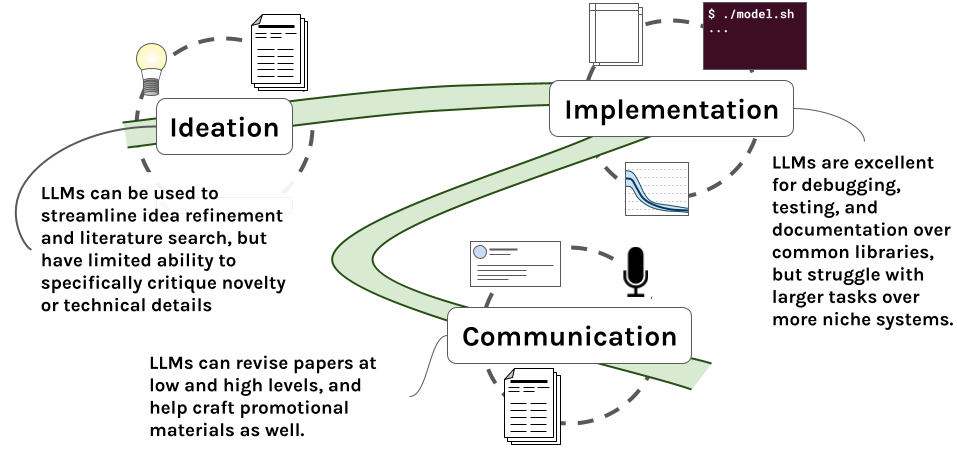

# Adapting to the era of Foundation Models (LLMs)
The last two years have witnessed a remarkable transformation in NLP through the advent of large language
models like GPT-4. This change has been driven not by new, open-source academic discoveries, but by corporate
partners leveraging unparalleled engineering, data, and computational scale to produce large language models
with exceptional performance. While these developments open up new practical and technological opportunities
that can benefit us all, they also pose a significant disruption to the academic research landscape in AI/ML
and NLP in particular. This page contains resources (typically in the form of prompts and recipes) for making
these new tools work for you to enhance your research across the research process. If you have other recipes
or systems you'd like to recommend, please don't hesitate to file an issue or sumbit a PR describing your
changes to this repository!



## Prompts & Recipes:

### Literature Review & Idea Refining
This prompt/recipe is focused on refining a paper idea and constructing an initial literature review. Here's
the core prompt:
```
I'm an academic researcher in machine learning and natural language processing, interested in speccing out an
idea for a new research project. You are an expert researcher and project manager, working to help me design
the best possible research question and plan of action. Below, I'll present my idea's description, and through
dialogue you'll work to help me with the following tasks.
**Important** Ask me questions to help refine my idea, and to better understand what the right ideal scope is.
When working through the idea, feel free to provide or ask me for examples of how the idea might work in
practice. We can work through as many stages of question answering as necessary.
**Important** Be constuctive, but critical when appropriate! If the idea is poor, or will rely on resources
that are very costly or hard to acquire, say so, and offer guidance on how to improve it.

Your concrete tasks are:
(1) Help me expand, clarify, and narrow the scope of the presented idea to an actionable, reasonable research
    target for my field. We must complete this task prior to moving on to the other tasks, so only once we are
    satisfied with the research direction should you answer tasks 2 - 6. It may take a few rounds of back and
    forth to do this.
(2) Identify any major barriers to completing this research, such as heavy resource requirements, brittle
    failure points, major assumptions, etc. Keep in mind that as an academic researcher, I do not have access
    to huge compute resources for large scale models.
(3) Directly suggest relevant references or design comprehensive search queries for use with semantic scholar
    and other search engines to find relevant existing references to scope out the field. Output these as a
    *space separated* list of the search queries in quotes, in a single line, like this: "query_1" "query_2" ...
(4) After you give me search queries, I will give you a collection results from running those queries over
    academic search engines. We'll work together to identify key resources to reference for this project and to
    see if anybody else has already done this idea, in which case we'll need to go back to the drawing board. For this task, you should output to me the following information, then pause and let me assess before we move on to task 5.

    Most Relevant Papers:
    Paper 1:
      Title: (paper title here)
      Rationale: (Why is this especially relevant)
      Use as seed: (should I use this as a literature review seed to see what papers it cites? Or what papers cite it? Or Both?)
    Paper 2:
      ...

    New Search Terms: "new query 1", ...

(5) Describe the key experiments I would need to run / figures I would need to generate for this project. 
    **Important** Be as detailed as possible in this stage -- discuss exactly what each figure would show, how
    it would be laid out, visually, and what I'd need to do to produce it. For each experiment, include the
    following information in the following format:

    Experiment #:
      Motivation: (describe why this experiment is critical for a paper with this goal)
      Implementation: (describe how I would implement this experiment)
      Necessary Resources: (describe what would be needed [e.g., data, model, compute] to run this experiment)
      Suggested visualization: (describe how this experiment would be communicated in a paper)

(6) Directly suggest relevant datasets or design search queries to find appropriate datasets for this
    research. Use the same format as in #3 for this.
(7) Craft a potential abstract paragraph and paper outline for this work.

Idea description:
```

To use this prompt effectively you should in addition actually run a search over publications based on the
provided search query to get updated papers and queries for a refined literature search. This can be done
programmatically via a [simple python script](./literature_search/ref_lookup.py).

I've used this prompt for sample ideas regarding
[KG curation via LLMs](./literature_search/GPT-4-Clinical-Knowledge-Graph.png) and in a testing capacity on an
idea that's already been published regarding 
[radiology report generation](./literature_search/X-ray-report-generation-RL.png). This second usage exposes a
major flaw with this recipe, which is that it is very reticient to state that ideas have already been explored
or that there isn't sufficient novelty in a work to pursue, even when given an idea that is a direct
contribution of an existing paper.

### Debugging & Testing

### Paper Review
